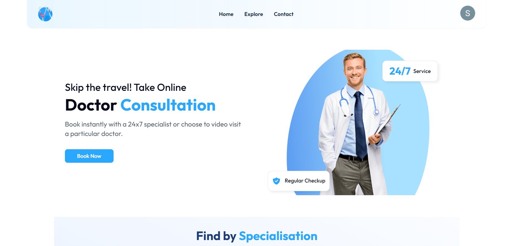

<!-- PROJECT LOGO -->
<br />
<div align="center">
  <a href="https://github.com/othneildrew/Best-README-Template">
    
  </a>

  <h3 align="center">Doctor Appointment Booking App</h3>
</div>

<!-- TABLE OF CONTENTS -->
<details>
  <summary>Table of Contents</summary>
  <ol>
    <li><a href="#about-the-project">About The Project</a></li>
    <li><a href="#features">Features</a></li>
    <li><a href="#built-with">Built With</a></li>
    <li><a href="#getting-started">Getting Started</a></li>
    <li><a href="#envs">Environment Variables</a></li>
    <li><a href="#documentation">Documentation</a></li>
  </ol>
</details>

<!-- ABOUT THE PROJECT -->
## About The Project
<div align="center">
    
</div>
</br>
</br>
The Doctor Appointment Booking app is designed to streamline the process of booking and managing medical appointments. Built with Next.js for the frontend and Strapi as the CMS, this project provides a smooth user experience, integrating Kinde Authentication for secure user access and Cloudinary for efficient media management. Postgres serves as the database, while Tailwind CSS and HyperUI ensure modern, responsive design. The app uses Jotai for state management and leverages React Email and Resend for communication services.

<!-- Features  -->
## Features
- [x] Search doctors
- [x] Detailed category pages
- [x] User auth (knide auth)
- [x] Doctor Detail Screen
- [x] Appointment booking with calendar and time slot
- [x] Email confirmation
- [x] Appointment booking, cancellation
- [x] User booking history 

<!-- GETTING STARTED -->
## Getting Started
This is a [Next.js](https://nextjs.org/) project bootstrapped with [`create-next-app`](https://github.com/vercel/next.js/tree/canary/packages/create-next-app).

First, run the development server:

```bash
npm run dev
# or
yarn dev
# or
pnpm dev
# or
bun dev
```

Open [http://localhost:3000](http://localhost:3000) with your browser to see the result.

You can start editing the page by modifying `app/page.js`. The page auto-updates as you edit the file.

This project uses [`next/font`](https://nextjs.org/docs/basic-features/font-optimization) to automatically optimize and load Inter, a custom Google Font.

### Learn More

To learn more about Next.js, take a look at the following resources:

- [Next.js Documentation](https://nextjs.org/docs) - learn about Next.js features and API.
- [Learn Next.js](https://nextjs.org/learn) - an interactive Next.js tutorial.

You can check out [the Next.js GitHub repository](https://github.com/vercel/next.js/) - your feedback and contributions are welcome!

### Deploy on Vercel

The easiest way to deploy your Next.js app is to use the [Vercel Platform](https://vercel.com/new?utm_medium=default-template&filter=next.js&utm_source=create-next-app&utm_campaign=create-next-app-readme) from the creators of Next.js.

Check out our [Next.js deployment documentation](https://nextjs.org/docs/deployment) for more details.

<!-- Environment Variables  -->
## Environment Variables

- `NEXT_PUBLIC_API_URL` - Strapi API Key
- `KINDE_CLIENT_ID` - Client ID of Kinde account which is used for authentication
- `KINDE_CLIENT_SECRET` - Secret Key of kinde account
- `KINDE_ISSUER_URL` - Already avaibale in account
- `KINDE_SITE_URL` - Site URL (eg, `http://localhost:3000`)
- `KINDE_POST_LOGOUT_REDIRECT_URL` - Where would the user redirect after logging out
- `KINDE_POST_LOGIN_REDIRECT_URL` - Where would the user redirect after login
- `NEXT_PUBLIC_BLOG_API` - Blog posts API key
- `RESEND_API_KEY` - Resend's (an emailer) API key to be inserted over here

<!-- Documentation -->
## Documentation

Checkout the below URL for full documentation for the project.

<div align="left">
<p><a href='https://docs.google.com/document/d/1jUrvx7YWEqd4TFok2vRQ3P1yGFCdlJAM2UAox2S1UWk/edit'>Documentation</a</p>
</div>